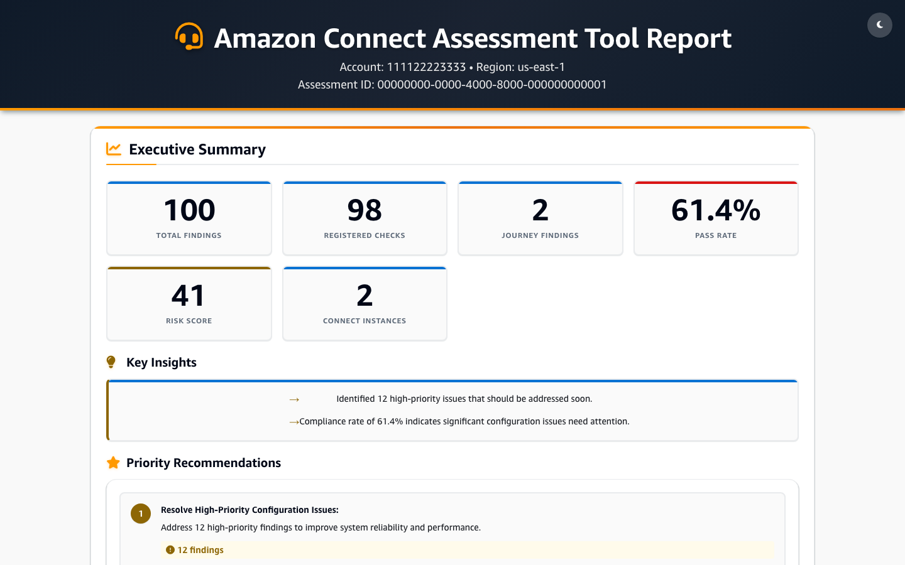
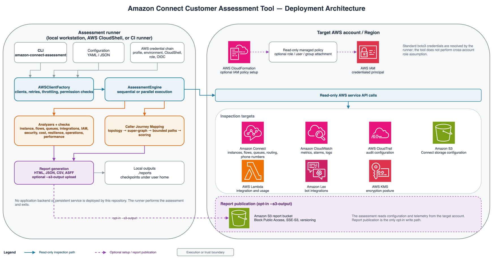

# Amazon Connect Customer Assessment Tool

[](https://www.python.org/downloads/)
[](LICENSE)
[](https://aws.amazon.com/architecture/well-architected/)


Evaluates Amazon Connect Customer deployments against AWS Well-Architected
Framework best practices across five pillars: **Resilience**, **Security**,
**Cost Optimization**, **Operational Excellence**, and **Performance
Efficiency**.

- **59 assessment checks** across the five Well-Architected pillars.
- **Caller Journey Mapping** — resolves inbound phone numbers to contact flows,
  renders an interactive caller-focused map, and separately scores caller paths
  for authentication, self-service, and dead-end outcomes.
- **Four report formats** — HTML, JSON, CSV, and ASFF (AWS Security Finding
  Format) for ingestion into Security Hub.
- **Read-only by default** — never mutates the resources it inspects; the only
  write is the opt-in `--s3-output`, which publishes the report to its own
  hardened S3 bucket.
- **Runs anywhere** — a single CLI using your existing AWS credentials, no
  agents or infrastructure to deploy.

## Table of Contents

- [Quick Start](#quick-start)
  - [Requirements](#requirements)
  - [Install](#install)
  - [Run](#run)
- [Sample Report](#sample-report)
- [What It Checks](#what-it-checks)
- [Deployment Architecture](#deployment-architecture)
- [Documentation](#documentation)
- [Security Model](#security-model)

## Quick Start

### Requirements

- Python 3.12 or higher
- AWS credentials with read access to the AWS account hosting the target Amazon Connect Customer instance
- Internet access to AWS API endpoints

### Install

For repeated workstation use:

```bash
brew install pipx                       # macOS
python3 -m pip install --user pipx      # Linux / Windows
python3 -m pipx ensurepath

git clone https://github.com/aws-samples/sample-connect-posture-assessment
cd sample-connect-posture-assessment
pipx install .
```

For contributor setup, testing, AWS access, CloudShell, and other installation
paths, see the [User Guide](docs/user-guide.md).

### Run

```bash
amazon-connect-assessment \
  --region us-east-1 \
  --output-dir ./reports
```

Open the generated HTML report:

```bash
open reports/connect_assessment_*.html        # macOS
xdg-open reports/connect_assessment_*.html    # Linux
```

## Sample Report

The repository includes a representative HTML report:



Regenerate the screenshot after changing the sample report:

```bash
pip install -e ".[screenshots]"
playwright install chromium
python scripts/capture_screenshots.py
```

Validate credentials and permissions before a full run:

```bash
amazon-connect-assessment --check-permissions --region us-east-1
```

For least-privilege permissions, review the generated canonical policy at
[`docs/iam-policy-template.json`](docs/iam-policy-template.json). Deploy the
same permission set with
[`cloudformation/AmazonConnectSelfAssessmentPolicy.yaml`](cloudformation/AmazonConnectSelfAssessmentPolicy.yaml),
or integrate the JSON actions into your existing role or permission set.

## What It Checks

| Area | Registered checks | Checks or findings |
|---|---:|---|
| Security | 22 | Encryption, CloudTrail, IAM, contact-flow authentication, approved origins, toll fraud, AI-agent security, Q assistant guardrail availability, and Q resource encryption |
| Resilience | 13 | Global Resiliency, CloudWatch alarms, flow error handling, loop detection, routing, carrier diversity, per-call-site Lambda dependency risk, and Q-scoped Bedrock cross-region availability |
| Cost Optimization | 15 | Unused numbers, containment, idle resources, callback opportunities, IVR data continuity, route-aware DTMF-only self-service, and Q prompt model cost review |
| Operational Excellence | 6 | Contact-flow logging, early media, SSML voice fallback, unreachable action analysis, Q knowledge-base lifecycle/ingestion health, and Q-scoped Bedrock logging |
| Performance Efficiency | 3 | Route-aware Lambda usage, descriptive flow structure metrics, and sequential Lambda routes |
| Caller Journey Mapping | Separate 4 findings | Phone-number topology, caller paths, authentication, self-service, and dead-end journeys |

The **Caller Journey Map** is phone-number-first. It uses
`connect:ListFlowAssociations` to match each `PhoneNumberArn` to its assigned
flow rather than treating `ListPhoneNumbersV2.TargetArn` as a flow ARN. The CLI
server-renders a deterministic caller-focused projection into the self-contained
HTML report; browser code switches phone-number views, applies zoom and fit
controls without squishing the native layout, opens the node/connector
inspector, and downloads SVG, PNG, or editable draw.io artifacts. There is no
separate web-service launcher required for this report flow.

Run `amazon-connect-assessment --list-checks` for the live check registry.
See the [Check Catalog](docs/check-catalog.md) for implemented checks and
journey findings.

## Deployment Architecture



## Documentation

The [Documentation](docs/README.md) is organized into the following detailed guides:

- [Deployment Architecture](#deployment-architecture) — rendered SVG
- [User Guide](docs/user-guide.md) — installation, AWS access, CLI usage, S3,
  run comparisons, and CI/CD
- [Configuration](docs/configuration.md) — YAML/JSON settings, precedence,
  output naming, and execution tuning
- [Report Formats](docs/report-formats.md) — HTML, JSON, CSV, and ASFF output
- [Check Catalog](docs/check-catalog.md) — checks, findings, permissions, and
  subset selection
- [Performance Guide](docs/performance-optimization.md) — parallel execution,
  retries, and journey-scoring bounds
- [Troubleshooting](docs/troubleshooting.md) — installation, credentials,
  permissions, runtime, and report issues
- [Development Guide](docs/development-guide.md) — architecture, testing, and
  adding checks
- [Threat Model](docs/threat-model.md) — trust boundaries and mitigations

## Security Model

The tool does not modify the Amazon Connect Customer resources it inspects. AWS credentials are resolved through the standard boto3 credential chain and are not written to reports. The optional S3 report bucket is hardened with Block Public Access, SSE-S3 encryption, and versioning.

See the [Threat Model](docs/threat-model.md) for security assumptions,
residual risks, and hardening recommendations.
